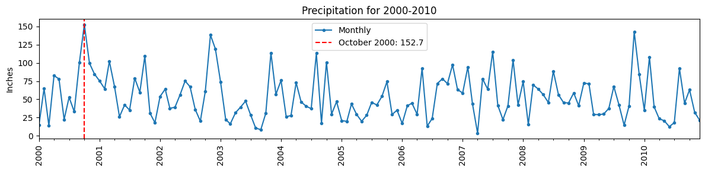
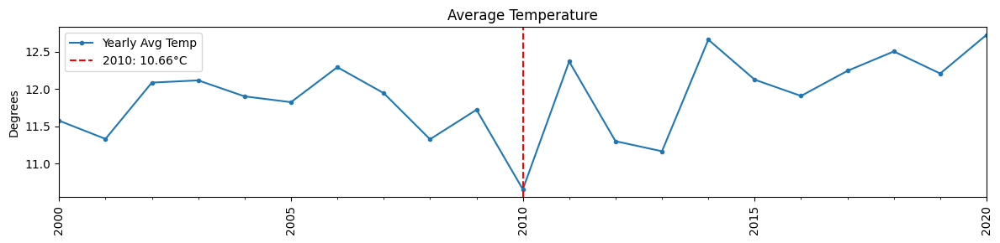

# London Weather — Resampling Datetime Data

Daily weather data from London (2000–2020), sourced from Kaggle. The goal is to practice datetime indexing, time series resampling, missing value imputation, and visualization.

---

## Dataset

**Source:** [Google Sheets (CSV)](https://docs.google.com/spreadsheets/d/e/2PACX-1vT_jChgNsQbHbg4TGepzIqk8XC9DTIKmyyxb1upo5cfZCgbfIUQc2ZC0YMzuU5uApP140Ob49KBjdqh/pub?gid=1198589591&single=true&output=csv)

**Features used:**

| Column | Description |
|--------|-------------|
| `precipitation` | Daily rainfall (inches) |
| `mean_temp` | Daily average temperature (°C) |
| `min_temp` | Daily minimum temperature (°C) |
| `max_temp` | Daily maximum temperature (°C) |
| `snow_depth` | Snow depth on ground (cm) |

---

## Part 1: Data Preparation

- Converted the `date` column from integer (`YYYYMMDD`) to `datetime` dtype
- Set `datetime` as the index to enable `.resample()`
- Filtered to records from 2000 onward
- Imputed missing values with different strategies per column:

| Column | Method | Reason |
|--------|--------|--------|
| `precipitation`, `mean_temp`, `min_temp`, `max_temp` | Interpolation | Gradual day-to-day transitions make smooth fill appropriate |
| `snow_depth` | Forward-fill then back-fill | Depth persists until melt; interpolating through a melt event produces false values |

---

## Part 2: Questions & Findings

### Q1: What month had the most precipitation between 2000 and 2010?

Resampled to monthly frequency using `.sum()`.

**Answer: October 2000 with 152.7 inches**



Precipitation fluctuates heavily month to month with no clear long-term trend, which is typical for rainfall data.

---

### Q2: Which year between 2000 and 2020 had the coolest average temperature?

Resampled to yearly frequency using `.mean()`.

**Answer: 2010 with an average of 10.66°C**



Before 2010, temperatures were relatively stable around 12°C. After 2010 there is a slight upward trend, with 2020 reaching the highest yearly average in the period.

---

## Requirements

```
pandas
matplotlib
```

---

## Author

Ali Abu Sohiban
